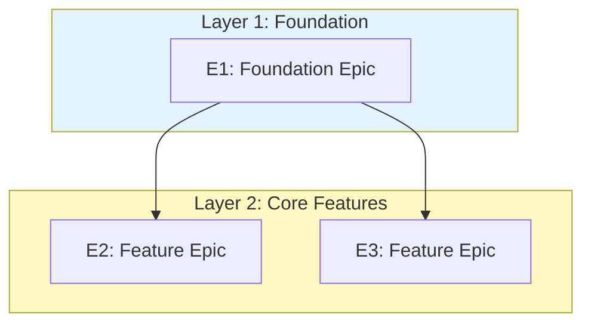
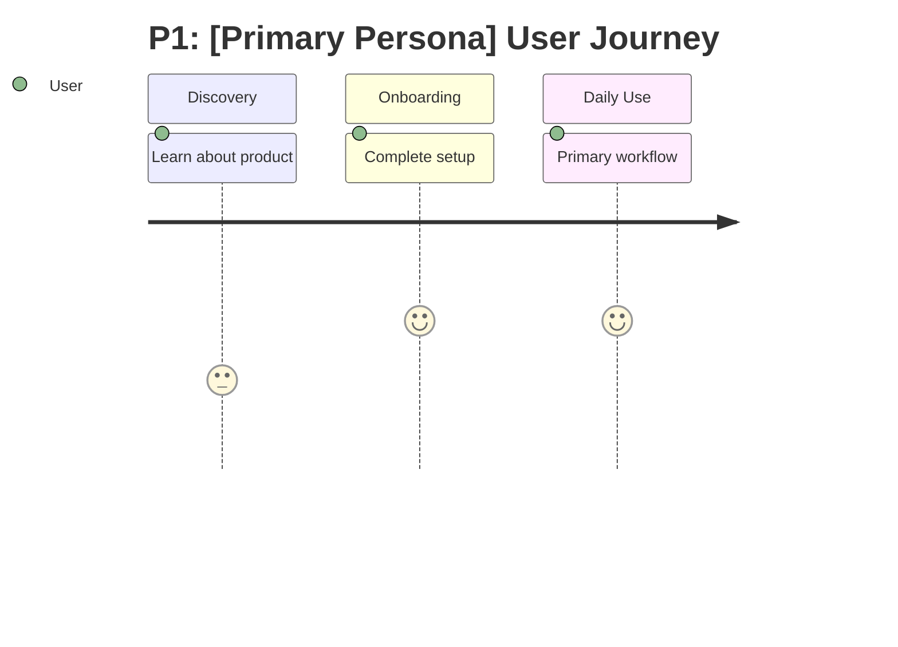
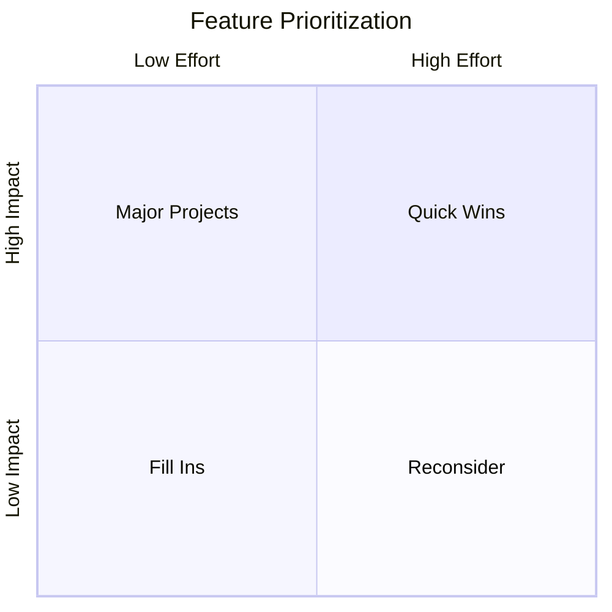
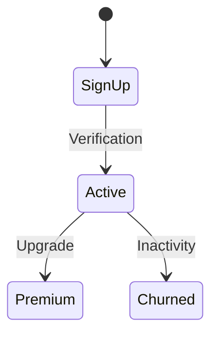

# PRD Generator — Deep Reference

Detailed methodology, step-by-step workflow, competitive-analysis approach, and integration
guidance for the PRD Generator. Load on demand when executing PRD generation. All audience,
taxonomy, and file-path values are decided per organization (see [`ADAPT.md`](ADAPT.md)); the
methodology below is universal.

---

## Phase 0: Research & Context Gathering (Detailed)

### Step 1: Locate the Vision Document

Resolve the product folder from your workspace convention and look for the vision file:
- the product's `*Vision*` document (e.g. a `Product-Vision` file)
- any file matching `*Vision*` in the product folder

### Step 2: Extract from the Vision Document

| Section | What to Extract |
|---------|-----------------|
| Executive Summary | Product description, problem, solution |
| Strategic Objectives | 4-6 objectives with key results |
| Value Propositions | Segments, benefits, pain points |
| Product Architecture | Modules, components, AI capabilities |
| Success Metrics | Targets by category |
| Market Opportunity | Segments, characteristics |
| Competitive Landscape | Differentiators |
| Risks | Key risks to address |
| Constraints | Scope, timeline, resources |

### Step 3: Gather Template Patterns

Read existing PRD documents (other products in your workspace) and the PRD
template at your template location to extract:
- Section structure and depth
- Feature specification format
- Persona template
- Epic breakdown patterns

### Step 4: Load Product Context

Load product-specific context from the product's context folder:

| File | Usage | Required |
|------|-------|----------|
| `product-identity` | Verify alignment with vision | Recommended |
| `personas` | Use as foundation for the persona section | Recommended |
| `pillars` | Understand product domain structure | Optional |
| `constraints` | Incorporate known constraints | Optional |
| `design-decisions` | Respect existing decisions | Optional |

If a `personas` context file exists, use it as the starting point for the Personas section
(enrich, don't replace), reconciled with your audience segments.

**Missing Context Handling**: If required context files are missing, notify the user, offer to
proceed by asking clarifying questions, and recommend creating context files for future use.

### Step 5: Create the Vision Analysis Summary

Generate a ~400-word summary structured as:
- **Product**: Name and brief description
- **Problem**: Core problem being solved
- **Target Market**: Primary segments from vision (cross-checked with your audience segments)
- **Strategic Objectives Extracted**: 4-6 objectives with key-results summary
- **Value Propositions by Segment**: Primary promise per segment
- **Product Architecture Summary**: Modules, AI capabilities, integrations
- **Constraints from Vision**: Scope, timeline, resources
- **Gaps Requiring Clarification**: Items needing user input

---

## Assumption Challenge Integration (Between Phase 0 and Phase 1)

**Invoke the Assumption Challenge** between Phase 0 (Research) and Phase 1 (Questions). Use
the org's assumption-challenge framework/skill if one is available; otherwise apply the
phases below directly.

| Challenge Phase | Applied | Trigger |
|-----------------|---------|---------|
| A: Question Why | Yes | User defines MVP scope or feature priorities |
| B: Alternatives | Yes | MoSCoW decisions, scope boundaries |
| C: Stress Test | Yes | Before finalizing PRD direction |

**Challenge Intensity:** Full (A + B + C)

**What to Challenge:**
- MVP scope: "Why are these features Must-Have vs Should-Have?"
- Feature prioritization: "What evidence supports this priority order?"
- Persona focus: "Why prioritize this persona over others?"
- Trade-offs: "What are you sacrificing with this scope?"

**Skip Challenge When:**
- User explicitly requests bypass ("skip challenge")
- PRD revision with minor scope changes
- User provides detailed rationale upfront

---

## Phase 1: Questions & User Input (Detailed)

### Step 1: Present Analysis to User

Show the Vision Analysis summary. The user sees what was extracted, strategic objectives
identified, personas/segments found, and gaps needing clarification.

### Step 2: Tailored Questions (7 Questions)

**Critical**: Questions must reference specific Vision content, not be generic.

#### SCOPE & PRIORITY (3 Questions)

**Q1. MVP Definition**
- List modules/components from the vision architecture
- List key results that imply features from objectives
- Ask the user to categorize as MoSCoW: Must Have, Should Have, Could Have, Won't Have (this release)
- Ask the MVP launch timeline

**Q2. Feature Prioritization**
- List strategic objectives extracted from the vision (numbered)
- Ask the user to rank objectives by priority for MVP
- Ask which objective is the CRITICAL one (makes or breaks launch)
- Ask the acceptable trade-off: more features/lower polish vs fewer features/higher quality vs balanced

**Q3. Epic Structure**
- Propose an epic structure based on architecture and objectives (table: Epic / Focus Area / Key Features)
- Ask: Does the structure make sense? Combine or split any? Ideal development order? Appropriate epic count?

#### PERSONAS (2 Questions)

**Q4. Persona Definition**
- List target segments from the vision and your audience segments with descriptions
- Ask the user to confirm which segments should map to personas
- Ask about additions or removals
- Ask who is the PRIMARY persona (most important to serve)
- Ask about demographics: age ranges, technical proficiency, geographic considerations

**Q5. Persona Priorities**
- Ask which persona has the MOST features designed for them
- Ask which persona is "secondary" (nice to serve, not critical)
- Ask about overlapping needs between personas
- Ask about anti-personas (who is this product NOT for?)

#### REQUIREMENTS (2 Questions)

**Q6. Success Criteria**
- List success metrics from the vision with targets
- Ask for MVP-specific success criteria: user count, revenue (or "not monetized yet"), engagement, performance targets
- Ask the definition of "MVP success" (specific metrics proving market fit)
- Ask what's NOT acceptable at launch

**Q7. Special Requirements**
- Accessibility: WCAG level (AA recommended)
- Security/Compliance: HIPAA, GDPR, SOC 2, or other
- AI Safety (if AI-powered): what AI must never do, crisis handling, human escalation triggers
- Integrations: auth providers, data sources, export/import requirements
- Platform: Web, iOS, Android, Desktop

---

## Phase 2: PRD Generation (Detailed)

### Step 1: Apply User Decisions

Map user answers to PRD sections:

| Decision | Impact on PRD |
|----------|---------------|
| MVP definition | MVP Scope Matrix, Feature priorities |
| Feature prioritization | Epic ordering, MoSCoW tags |
| Epic structure | Epic Overview Map |
| Persona definition | User Personas section |
| Success criteria | Success Metrics, Launch criteria |
| Special requirements | Accessibility, Security, AI Safety |

### Step 2: Generate Sections (Sequential)

For each section, sequentially:
1. Reference the Vision Analysis and user answers
2. Generate section content using the template
3. Cross-reference with Vision objectives
4. Ensure coverage of all strategic goals

**Section Generation Order:**
1. Executive Summary (inherits from Vision)
2. Product Vision & Success Metrics
3. Core Design Principles
4. User Personas (5)
5. Epic Overview Map
6. MVP vs Future Scope Matrix
7. Success Criteria Checklist
8. Feature Template Reference
9. Cross-Reference Index
10. Competitive Analysis
11. Error Handling & Edge Cases
12. Accessibility Requirements
13. Account Management
14. AI Safety Boundaries (if applicable)
15. Data Management

**Why Sequential:** Vision alignment maintained, consistency across sections, dependencies
built correctly, coverage verified in real-time.

### Step 3: Generate Visual Documentation (Mermaid Diagrams)

| Diagram | Mermaid Type | Section | When to Generate |
|---------|--------------|---------|------------------|
| System Architecture | `flowchart TB` | Epic Overview Map | Always |
| User Journey Map | `journey` | User Personas | For P1 (primary persona) |
| Feature Priority Matrix | `quadrantChart` | MVP vs Future Scope | If 8+ features |
| Error Recovery Tree | `flowchart TD` | Error Handling | Always |
| Account Lifecycle | `stateDiagram-v2` | Account Management | Always |
| Data Flow Architecture | `flowchart LR` | Data Management | If multi-source data |
| AI Agent Interaction | `flowchart TD` | AI Safety Boundaries | If AI product |

**Diagram Color Scheme Standard:**

| Color | Hex | Usage |
|-------|-----|-------|
| Blue (light) | `#e3f2fd` | Process steps, foundation layers |
| Yellow | `#fff9c4` | Warnings, decisions, core layers |
| Green (light) | `#c8e6c9` | Success states, outputs, top layers |
| Red (light) | `#ffcdd2` | Risks, errors, blockers |

**System Architecture Example:**


**User Journey Map Example:**


**Feature Priority Matrix Example:**


**Account Lifecycle Example:**


---

## Phase 3: Validation (Blocking) (Detailed)

### Critical Checks (Block if Fail)

| Check | Criteria | Action if Fail |
|-------|----------|----------------|
| **Vision Coverage** | Every strategic objective has features | Add missing features |
| **Persona Coverage** | Every persona has relevant features | Expand feature set |
| **Section Coverage** | All required sections present | Add missing sections |
| **Completeness** | No TBD, placeholder, or empty content | Fill in gaps |

### Quality Checks (Warning; Block if >3)

| Check | Criteria | Action if Fail |
|-------|----------|----------------|
| **Metrics Quantified** | All success metrics have numbers | Add targets |
| **Epic Dependencies** | Clear dependency mapping | Add dependency info |
| **MoSCoW Tagged** | All features have a priority tag | Add priorities |
| **Acceptance Criteria** | Testable format for key features | Rewrite criteria |

### Vision Coverage Matrix

Generate at the end of Phase 2 and validate:

```markdown
| Vision Objective | PRD Epic | Features | Status |
|------------------|----------|----------|--------|
| [Objective 1]    | E01      | F1.1-F1.5| check  |
| [Objective 2]    | E02, E03 | F2.1-F3.3| check  |
| [Objective 3]    | E04      | F4.1-F4.4| check  |
| [Objective 4]    | E05      | F5.1-F5.2| check  |
| **Coverage**     |          |          | 100%   |
```

### Validation Output
- All checks pass: proceed to Phase 4
- Any critical check fails: return to Phase 2, fix, re-validate

---

## Phase 4: Output & Tracking (Detailed)

### Step 1: Write the PRD File

Write the requirements document to the product folder, named per your filename convention.

### Step 2: Update the Progress File

Append a session entry to the product's progress file:
- Session timestamp
- Product name
- PRD created
- Key decisions made
- Epic count and structure
- Open questions for the architecture phase

### Step 3: Output Pipeline Hooks

Include in the PRD for downstream consumption:
- Feature requirements for the technical-architecture skill
- Persona references
- Constraints and integration requirements
- Format: `<!-- ARCHITECTURE_READY: [product-code] -->`

Note: the PRD feeds into the technical-architecture skill before the epic-generator skill.

---

## Competitive Analysis Methodology (Inspiration-Focused)

**Purpose:** Learn from existing solutions. Don't reinvent the wheel. This is NOT market
positioning analysis.

### Structure

**Category 1: Direct Alternatives**

| Solution | What They Do Well | Patterns to Adopt | Our Differentiation |
|----------|-------------------|-------------------|---------------------|
| [Solution A] | [Strength] | [Pattern to learn] | [How we're different] |
| [Solution B] | [Strength] | [Pattern to learn] | [How we're different] |

**Category 2: Adjacent Products**

| Solution | What They Do Well | Patterns to Adopt | Our Differentiation |
|----------|-------------------|-------------------|---------------------|
| [Solution C] | [Strength] | [Pattern to learn] | [How we're different] |
| [Solution D] | [Strength] | [Pattern to learn] | [How we're different] |

### Best Practices to Adopt

| Practice | Source | Implementation |
|----------|--------|----------------|
| [Practice 1] | Industry standard | [How we'll implement] |
| [Practice 2] | From [Solution A] | [How we'll implement] |
| [Practice 3] | UX best practice | [How we'll implement] |

### Where Others Fall Short (Our Opportunity)

| Gap | Why Existing Solutions Fail | Our Approach |
|-----|----------------------------|--------------|
| [Gap 1] | [Why they fail] | [How we solve it] |
| [Gap 2] | [Why they fail] | [How we solve it] |

### Design Inspiration

| Element | Inspiration Source | Application |
|---------|-------------------|-------------|
| [UI Pattern] | [Source] | [How we'll use it] |
| [UX Flow] | [Source] | [How we'll use it] |

---

## MoSCoW Prioritization Guidance

All features in the PRD receive a MoSCoW tag:

| Tag | Meaning | Criteria |
|-----|---------|----------|
| **Must Have** | Core MVP; product cannot launch without it | Blocks the primary persona's core workflow |
| **Should Have** | Important but a workaround exists | Improves the primary persona experience significantly |
| **Could Have** | Nice to have; included if time permits | Benefits secondary personas or edge cases |
| **Won't Have** | Explicitly out of scope for this release | Documented for future releases |

**Decision Framework:**
- If removing it breaks the primary user journey, it is Must Have
- If removing it degrades but does not break the experience, it is Should Have
- If only a subset of users would notice, it is Could Have

---

## Feature Categorization Patterns

Features follow the format `F[Epic].[Seq]` (e.g., F1.1, F2.3).

Each feature must include:
- **Priority**: P0/P1/P2/P3
- **MVP Status**: Core / MVP / Enhanced / Future
- **Personas Served**: P1, P2, etc.
- **User Story**: As a [persona], I want to [action] so that [benefit]
- **Acceptance Criteria**: Testable checklist items
- **Error Scenarios**: Table of scenario + handling
- **Dependencies**: Links to prerequisite features

---

## Dependency Mapping

### Epic-Level Dependencies

Each epic must declare:
- **Depends On**: which epics must be completed first
- **Blocks**: which epics are waiting on this one
- **Parallel With**: which epics can be built simultaneously

### Feature-Level Dependencies

Within epics, features may depend on features from other epics. Document as:
- `F[X.Y]` depends on `F[A.B]`: [reason]

### Development Order

The epic summary table includes a recommended development order based on dependencies:
- Layer 1 (Foundation): no dependencies, build first
- Layer 2 (Core): depends on Layer 1
- Layer 3 (Enhanced): depends on Layers 1-2
- Layer 4 (Advanced): depends on all prior layers

---

## Integration Details

### Upstream: Vision Generator

**What the PRD inherits from Vision:**
- Strategic objectives (mapped 1:1 to features)
- Target market segments (mapped to personas, cross-checked with your audience segments)
- Value propositions (addressed in features)
- Success metrics (refined with MVP targets)
- Competitive landscape (expanded into inspiration analysis)
- Constraints (incorporated into scope decisions)

**The PRD must NOT:**
- Contradict vision objectives
- Introduce new strategic goals
- Expand beyond vision scope without user approval

### Downstream: Tech Architecture Generator

**What the PRD provides to architecture:**
- Feature requirements with acceptance criteria
- Epic structure and dependencies
- Integration requirements
- Performance and security requirements
- AI capabilities and safety boundaries
- Pipeline hook: `<!-- ARCHITECTURE_READY: [product-code] -->`

### Downstream: Epic Generator

**What the PRD provides (via the architecture skill):**
- Epic overview map with dependencies
- Feature-level scope definitions
- MoSCoW priorities for phased delivery
- Persona-to-feature mappings

### Peer: Product Manager

**Alignment points:**
- MoSCoW prioritization methodology
- Product lifecycle stage (the PRD belongs to the design & planning stage; use the
  product's actual lifecycle stage)
- PRD structure compatible with the PM review workflow

---

## Quality Criteria and Standards

### Output Quality Bar

Calibrate against the org's existing reference PRDs (other products in your workspace):
- **Typical Length**: 800-1200 lines
- **Sections**: 15+ required sections
- **Personas**: 5, fully detailed with demographics, goals, pain points, feature priorities
- **Epics**: 6-12 typically, with dependency mapping
- **Features per Epic**: 3-8 with full specification format
- **Metrics**: all quantified with MVP and ultimate targets
- **Visual Documentation**: Mermaid diagrams for architecture, journeys, state machines

### Section Depth Guidelines

| Section | Expected Depth |
|---------|---------------|
| Executive Summary | 150-250 words |
| Product Vision & Metrics | 8+ metrics table with 5 columns |
| Core Design Principles | 3-5 principles with 3+ application bullets each |
| User Personas | 5 personas, each with demographics, background, goals, pain points, success story, feature priorities |
| Epic Overview Map | Visual diagram + summary table + per-epic descriptions |
| MVP vs Future Scope | Feature-level matrix across release versions |
| Success Criteria | Per-epic checklists + MVP launch criteria |
| Competitive Analysis | 4+ solutions analyzed, best practices table, gaps table |
| Error Handling | Global patterns table + per-epic edge cases |
| Accessibility | WCAG target, 6+ requirements, testing checklist |
| Account Management | Types table, lifecycle diagram, retention policies |
| Data Management | Classification table, sources table, privacy checklist |
